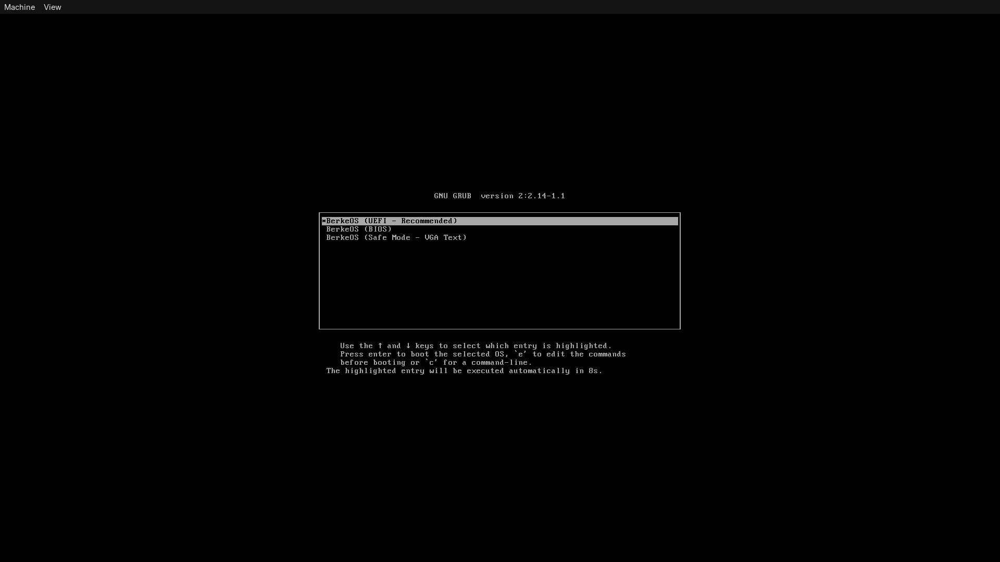
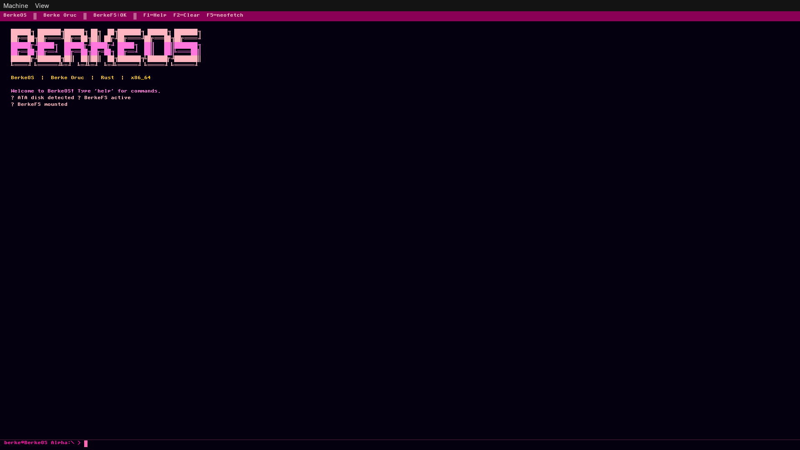
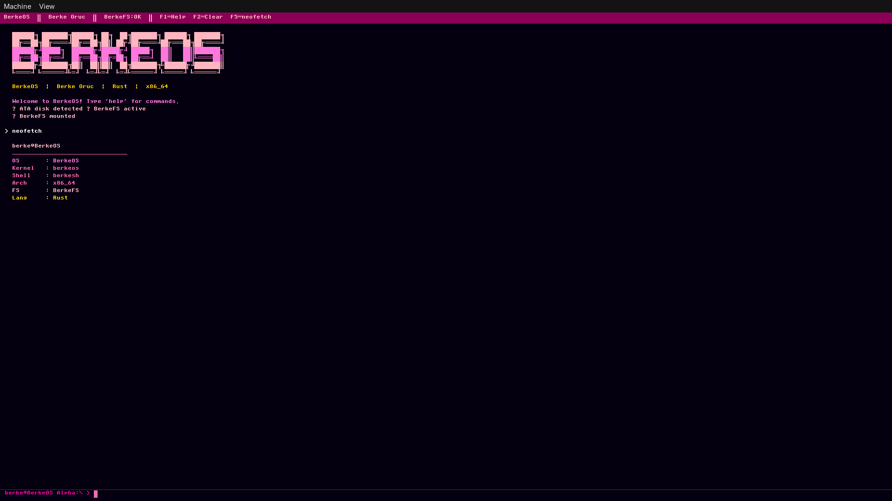
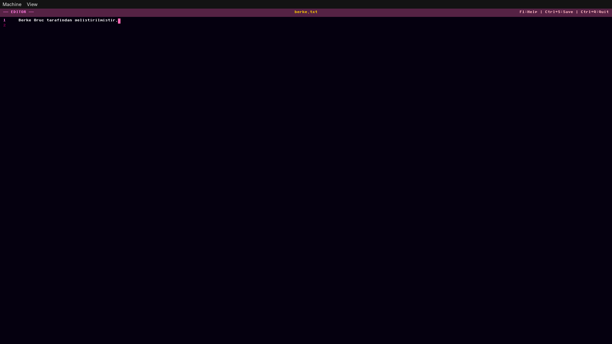
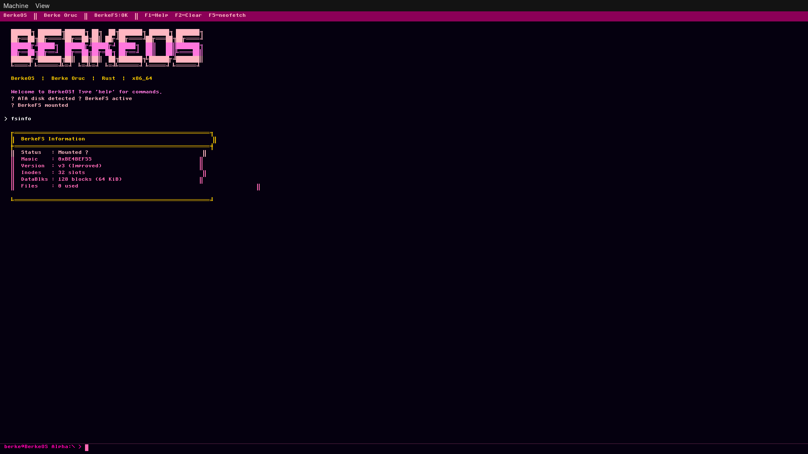
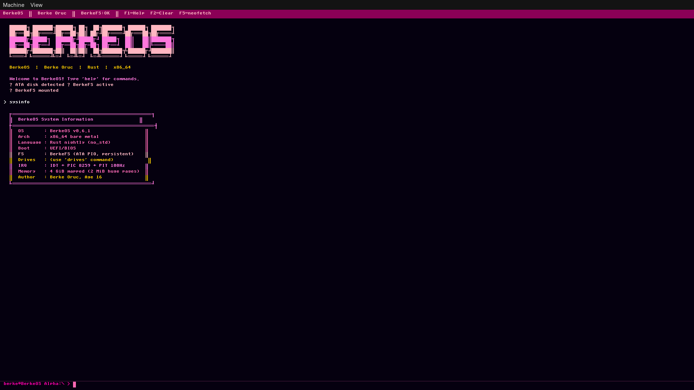
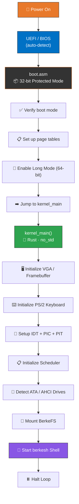
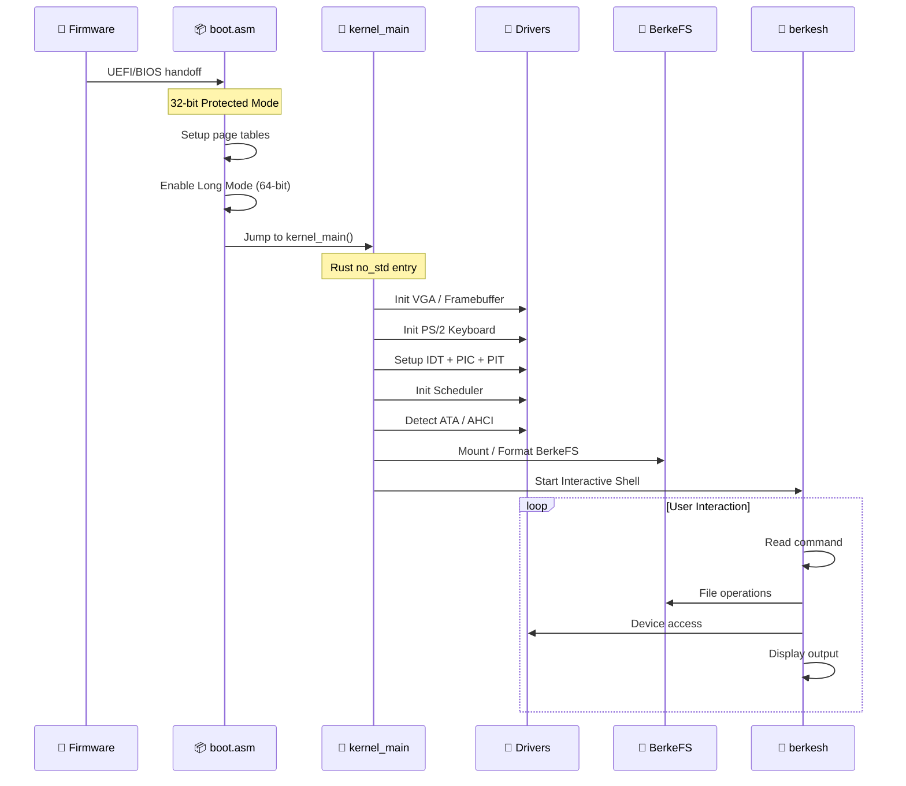
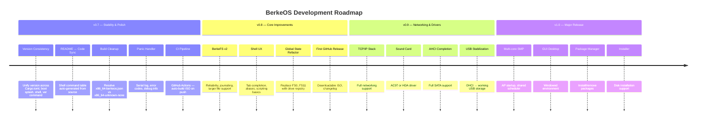

<div align="center">

<!-- ═══════════════════════════════════════════════════════════════════════ -->
<!--                          HERO BANNER SECTION                          -->
<!-- ═══════════════════════════════════════════════════════════════════════ -->


<br/>

<!-- Animated Typing SVG -->
<a href="https://github.com/berkeoruc/berkeos">
  
</a>

<br/>

<!-- Primary Badges Row -->
[](https://www.rust-lang.org/)
[](#architecture)
[](LICENSE)
[](#changelog)
[](#code-statistics)

<br/>

<!-- Secondary Badges Row -->
[](https://github.com/berkeoruc/berkeos/stargazers)
[](https://github.com/berkeoruc/berkeos/network)
[](https://github.com/berkeoruc/berkeos/issues)
[](https://github.com/berkeoruc/berkeos/commits)
[](https://github.com/berkeoruc/berkeos)

<br/>

<!-- Tagline -->
> **🇹🇷 Built from scratch by a 16-year-old developer from Turkey**
> 
> *A modern, DOS-inspired operating system proving that with dedication and AI assistance, anyone can build an OS.*

<br/>

<!-- Quick Links -->
[](#-quick-start)&nbsp;&nbsp;
[](#-architecture)&nbsp;&nbsp;
[](#-roadmap)&nbsp;&nbsp;
[](#-contributing)

</div>

<!-- ═══════════════════════════════════════════════════════════════════════ -->
<!--                       DECORATIVE SEPARATOR                            -->
<!-- ═══════════════════════════════════════════════════════════════════════ -->


<!-- ═══════════════════════════════════════════════════════════════════════ -->
<!--                        TABLE OF CONTENTS                              -->
<!-- ═══════════════════════════════════════════════════════════════════════ -->

## 📑 Table of Contents

<details open>
<summary><b>Click to expand/collapse</b></summary>

```
 ╔══════════════════════════════════════════╗
 ║  🎯 About the Project                    ║
 ║  👨‍💻 About the Developer                  ║
 ║  📸 Screenshots                          ║
 ║  ✅ Module Status                        ║
 ║  🛠️ Features                             ║
 ║  📊 Code Statistics                      ║
 ║  🚀 Quick Start                          ║
 ║  🏗️ Architecture                         ║
 ║  💻 Shell Commands                       ║
 ║  ⚙️ How It Works                         ║
 ║  🦀 Why Rust?                            ║
 ║  🗺️ Roadmap                              ║
 ║  🤝 Contributing                         ║
 ║  📄 License                              ║
 ║  🙏 Acknowledgments                      ║
 ╚══════════════════════════════════════════╝
```

</details>


<!-- ═══════════════════════════════════════════════════════════════════════ -->
<!--                         ABOUT THE PROJECT                             -->
<!-- ═══════════════════════════════════════════════════════════════════════ -->

## 🎯 About the Project

<div align="center">

```
__/\\\\\\\\\\\\\___________________________________________________________________/\\\\\__________/\\\\\\\\\\\___        
 _\/\\\/////////\\\_______________________________/\\\____________________________/\\\///\\\______/\\\/////////\\\_       
  _\/\\\_______\/\\\______________________________\/\\\__________________________/\\\/__\///\\\___\//\\\______\///__      
   _\/\\\\\\\\\\\\\\______/\\\\\\\\___/\\/\\\\\\\__\/\\\\\\\\________/\\\\\\\\___/\\\______\//\\\___\////\\\_________     
    _\/\\\/////////\\\___/\\\/////\\\_\/\\\/////\\\_\/\\\////\\\____/\\\/////\\\_\/\\\_______\/\\\______\////\\\______    
     _\/\\\_______\/\\\__/\\\\\\\\\\\__\/\\\___\///__\/\\\\\\\\/____/\\\\\\\\\\\__\//\\\______/\\\__________\////\\\___   
      _\/\\\_______\/\\\_\//\\///////___\/\\\_________\/\\\///\\\___\//\\///////____\///\\\__/\\\_____/\\\______\//\\\__  
       _\/\\\\\\\\\\\\\/___\//\\\\\\\\\\_\/\\\_________\/\\\_\///\\\__\//\\\\\\\\\\____\///\\\\\/_____\///\\\\\\\\\\\/___ 
        _\/////////////______\//////////__\///__________\///____\///____\//////////_______\/////_________\///////////_____
```

</div>

**BerkeOS** is a modern, DOS-inspired operating system developed entirely from scratch using Rust (`no_std`). It features a complete boot chain, monolithic kernel, custom filesystem, interactive shell, device drivers, and more — all built with zero budget using free AI tools.

<table>
<tr>
<td width="50%">

### 🔑 Key Highlights

- 🦀 **Pure Rust** — `no_std` monolithic kernel
- 🖥️ **Bare Metal** — Boots on real x86_64 hardware
- 📁 **Custom FS** — BerkeFS with ATA PIO support
- 🐚 **Rich Shell** — `berkesh` with 30+ commands
- ✏️ **Text Editor** — Built-in `deno` editor
- 🎵 **Audio** — PC Speaker beep & melodies
- ⏰ **Real-Time** — RTC clock integration
- 🔒 **Memory Safe** — Rust's ownership model

</td>
<td width="50%">

### 📈 Project Stats

| Metric | Value |
|:---|:---|
| 🏗️ Architecture | `x86_64` (Long Mode) |
| 🦀 Language | Rust (nightly, `no_std`) |
| 🔧 Assembler | NASM (boot stage) |
| 📦 Build System | Custom (Cargo + NASM + LD + GRUB) |
| 🖥️ Emulator | QEMU |
| 📏 Total Lines | ~14,288 |
| 💰 Build Cost | **0 TL** |
| 📅 Started | 2024 (developer age 14) |

</td>
</tr>
</table>


<!-- ═══════════════════════════════════════════════════════════════════════ -->
<!--                        ABOUT THE DEVELOPER                            -->
<!-- ═══════════════════════════════════════════════════════════════════════ -->

## 👨‍💻 About the Developer

<div align="center">

<table>
<tr>
<td align="center" width="200px">
  <br/>
  
  <br/><br/>
  <b>Berke Oruç</b>
  <br/>
  <sub>Age 16 · Turkey 🇹🇷</sub>
  <br/><br/>
  <a href="https://github.com/berkeoruc">
    
  </a>
</td>
<td>

> *"I wanted to prove that with dedication and AI assistance, anyone can build an operating system from scratch."*

| Detail | Info |
|:---|:---|
| 🎂 **Age** | 16 years old |
| 🌍 **Location** | Turkey 🇹🇷 |
| 🚀 **Started** | Age 8 (2018) with js |
| 🎯 **Motivation** | Proving OS development is accessible to anyone |
| 💰 **Cost** | 0 TL — built entirely with free AI tools |
| 🤖 **AI Tools** | Free AI assistants for code generation & learning |

</td>
</tr>
</table>

</div>


<!-- ═══════════════════════════════════════════════════════════════════════ -->
<!--                           SCREENSHOTS                                 -->
<!-- ═══════════════════════════════════════════════════════════════════════ -->

## 📸 Screenshots

<div align="center">

> ⚠️ **Note:** Some of the screenshots may not be uploaded yet.

<table>
<tr>
<td align="center" width="50%">

<br/><sub><b>🖥️ Boot Screen</b> — UEFI/BIOS auto-detection</sub>
</td>
<td align="center" width="50%">

<br/><sub><b>🐚 berkesh Shell</b> — Interactive command line</sub>
</td>
</tr>
<tr>
<td align="center" width="50%">

<br/><sub><b>📊 Neofetch</b> — System information</sub>
</td>
<td align="center" width="50%">

<br/><sub><b>✏️ Deno Editor</b> — Built-in text editor</sub>
</td>
</tr>
</table>

<details>
<summary><b>🖼️ Click to see more screenshots</b></summary>
<br/>

<table>
<tr>
<td align="center" width="33%">

<br/><sub><b>📁 BerkeFS</b> — File operations</sub>
</td>
<td align="center" width="33%">

<br/><sub><b>🧮 Calculator</b> — Built-in calc</sub>
</td>
<td align="center" width="33%">

<br/><sub><b>💻 Sysinfo</b> — Hardware info</sub>
</td>
</tr>
</table>

</details>

</div>


<!-- ═══════════════════════════════════════════════════════════════════════ -->
<!--                         MODULE STATUS TABLE                           -->
<!-- ═══════════════════════════════════════════════════════════════════════ -->

## ✅ Module Status

> **Transparency Note:** This table reflects the *actual implementation status* as derived from the source code. It is the single source of truth for what works, what's experimental, and what's planned.

<div align="center">

| Module | Source File(s) | Status | Description |
|:---|:---|:---:|:---|
| 🟢 **Boot Chain** | `boot.asm`, `linker.ld` |  | 32→64 bit Long Mode, page tables, kernel jump |
| 🟢 **VGA Text Mode** | `vga.rs` |  | 80×25 color text output, scrolling |
| 🟢 **Framebuffer** | `framebuffer.rs`, `font.rs` |  | Graphical framebuffer, font rendering |
| 🟢 **IDT + PIC + PIT** | `idt.rs`, `pic.rs`, `pit.rs` |  | Interrupts, 8259 PIC, 100Hz timer |
| 🟢 **PS/2 Keyboard** | `keyboard.rs` |  | Scan code → keypress, layout support |
| 🟢 **Memory Paging** | `paging.rs`, `allocator.rs` |  | 2 MiB huge pages, heap allocator |
| 🟢 **ATA PIO Disk** | `ata.rs` |  | Read/write sectors, disk detection |
| 🟢 **BerkeFS** | `berkefs.rs` |  | Custom filesystem, dirs, files, mount |
| 🟢 **Shell (berkesh)** | `shell.rs` |  | 30+ commands, history, tab support |
| 🟢 **Deno Editor** | `deno.rs`, `editor.rs` |  | Built-in text editor |
| 🟢 **RTC Clock** | `rtc.rs` |  | Real-time clock, date/time |
| 🟢 **PC Speaker** | `pcspeaker.rs`, `audio.rs` |  | Beep, melodies via PIT |
| 🟢 **Scheduler** | `scheduler.rs`, `process.rs` |  | Basic process scheduling |
| 🟢 **Syscalls** | `syscall.rs` |  | System call interface |
| 🟡 **AHCI/SATA** | `ahci.rs` |  | SATA controller detection, WIP |
| 🟡 **USB Stack** | `usb/` |  | OHCI, USB storage — early stage |
| 🟡 **Network** | `net/`, `rtl8139.rs` |  | IPv4/ARP buffers, RTL8139 — early stage |
| 🟡 **Image Viewer** | `image.rs` |  | Basic image display |
| 🔴 **TCP/IP Stack** | — |  | Full networking support |
| 🔴 **Sound Card** | — |  | AC97/HDA audio driver |
| 🔴 **Multi-core SMP** | — |  | Multi-core CPU support |
| 🔴 **USB 3.0** | — |  | xHCI driver |
| 🔴 **GUI Desktop** | — |  | Windowed desktop environment |
| 🔴 **Package Manager** | — |  | Package installation & management |

</div>

> **Legend:**
> 🟢 **Implemented** — Working and tested in QEMU &nbsp;|&nbsp;
> 🟡 **Experimental** — Code exists but incomplete/untested &nbsp;|&nbsp;
> 🔴 **Planned** — On the roadmap, no code yet


<!-- ═══════════════════════════════════════════════════════════════════════ -->
<!--                            FEATURES                                   -->
<!-- ═══════════════════════════════════════════════════════════════════════ -->

## 🛠️ Features

<div align="center">

<table>
<tr>
<td align="center" width="25%">
<br/>

<br/><br/>
<b>Custom Kernel</b>
<br/>
Monolithic kernel in Rust<br/>
<code>no_std</code> · bare metal<br/>
Long Mode (64-bit)
<br/><br/>
</td>
<td align="center" width="25%">
<br/>

<br/><br/>
<b>Custom Filesystem</b>
<br/>
BerkeFS with ATA PIO<br/>
Dirs · Files · Mount<br/>
Multi-drive support
<br/><br/>
</td>
<td align="center" width="25%">
<br/>

<br/><br/>
<b>Interactive Shell</b>
<br/>
30+ built-in commands<br/>
History · Navigation<br/>
Rich UX
<br/><br/>
</td>
<td align="center" width="25%">
<br/>

<br/><br/>
<b>Device Drivers</b>
<br/>
VGA · PS/2 · ATA · RTC<br/>
PC Speaker · AHCI<br/>
Framebuffer
<br/><br/>
</td>
</tr>
</table>

</div>

<details>
<summary><b>📋 Detailed Feature List (click to expand)</b></summary>

### 🧠 Kernel & Boot
- ✅ Monolithic kernel in Rust (`no_std`, `#![no_main]`)
- ✅ UEFI/BIOS auto-detection boot
- ✅ `boot.asm` — 32-bit → Long Mode transition
- ✅ Page tables with 2 MiB huge pages
- ✅ Heap allocator
- ✅ IDT + PIC 8259 + PIT 100Hz timer
- ✅ Basic process scheduler & syscall interface

### 📁 Filesystem & Storage
- ✅ BerkeFS — custom filesystem (up to 12 drives)
- ✅ ATA PIO disk read/write
- ✅ Directory tree, file ops (create, read, write, delete)
- ✅ Drive mount/unmount/format
- 🧪 AHCI SATA controller detection (experimental)

### 🐚 Shell & User Interface
- ✅ `berkesh` — interactive CLI with 30+ commands
- ✅ VGA text mode with color support (80×25)
- ✅ Framebuffer graphics mode with font rendering
- ✅ `deno` — built-in text editor
- ✅ Calculator, neofetch, system info
- ✅ Command history

### 🔌 Device Drivers
- ✅ PS/2 keyboard with scan code translation
- ✅ RTC (Real-Time Clock)
- ✅ PC Speaker (beep, play melodies)
- 🧪 RTL8139 network card driver (experimental)
- 🧪 USB OHCI + mass storage (experimental)

</details>


<!-- ═══════════════════════════════════════════════════════════════════════ -->
<!--                         CODE STATISTICS                               -->
<!-- ═══════════════════════════════════════════════════════════════════════ -->

## 📊 Code Statistics

<div align="center">

```
     ╔═══════════════════════════════════════════════════╗
     ║              CODE AUTHORSHIP BREAKDOWN            ║
     ╠═══════════════════════════════════════════════════╣
     ║                                                   ║
     ║   Developer Written    ████████████░░░░░  43%       ║
     ║   AI-Assisted          ████████████████░  57%        ║
     ║                                                    ║
     ║   Total Lines: ~14,288                            ║
     ║   By Developer: ~6,143 lines                      ║
     ║   AI-Assisted: ~8,145 lines                       ║
     ║   Build Cost: 0 TL                                ║
     ║                                                   ║
     ╚═══════════════════════════════════════════════════╝
```

<table>
<tr>
<td align="center">

</td>
<td align="center">

</td>
<td align="center">

</td>
<td align="center">

</td>
</tr>
</table>

</div>


<!-- ═══════════════════════════════════════════════════════════════════════ -->
<!--                           QUICK START                                 -->
<!-- ═══════════════════════════════════════════════════════════════════════ -->

## 🚀 Quick Start

### 📋 Prerequisites

<table>
<tr>
<td width="50%">

#### 🏔️ Arch Linux

```bash
sudo pacman -S rust nasm grub xorriso qemu

# Rust nightly toolchain
rustup override set nightly
rustup component add rust-src llvm-tools-preview
```

</td>
<td width="50%">

#### 🐧 Ubuntu / Debian

```bash
sudo apt install build-essential rustc nasm \
  grub-pc-bin xorriso qemu-system-x86

# Rust nightly toolchain
rustup override set nightly
rustup component add rust-src llvm-tools-preview
```

</td>
</tr>
</table>

### ⚡ Build & Run

```bash
# 1️⃣  Clone the repository
git clone https://github.com/berkeoruc/berkeos.git
cd berkeos

# 2️⃣  Build the OS (creates bootable ISO)
chmod +x build.sh
./build.sh

# 3️⃣  Run in QEMU
chmod +x run.sh
./run.sh
```

<details>
<summary><b>🔧 Build Process Details (click to expand)</b></summary>

The build pipeline works as follows:

```
build.sh Pipeline
─────────────────
  1. NASM compiles boot.asm → boot.o (32-bit bootstrap)
  2. Cargo builds kernel as staticlib (x86_64-unknown-none)
  3. ld links boot.o + libkernelos.a → kernel.bin
  4. grub-mkrescue packages into bootable ISO
  
run.sh Pipeline
───────────────
  1. Creates QEMU disk images (if not present)
  2. Launches QEMU with IDE drives + ISO
  3. Connects serial output for debugging
```

> ⚠️ **Note:** The repo contains `x86_64-berkeos.json` (custom target spec), but the current `build.sh` uses `x86_64-unknown-none`. This is a known inconsistency that will be cleaned up in v0.7.

</details>


<!-- ═══════════════════════════════════════════════════════════════════════ -->
<!--                          ARCHITECTURE                                 -->
<!-- ═══════════════════════════════════════════════════════════════════════ -->

## 🏗️ Architecture

### Boot Flow Diagram



### Project Structure

```
BerkeOS/
│
├── 📄 Cargo.toml                 # Rust project config (staticlib)
├── 📄 x86_64-berkeos.json        # Custom target spec
├── 📄 linker.ld                  # Linker script (ENTRY: start)
├── 🔧 build.sh                   # Build pipeline
├── 🔧 run.sh                     # QEMU launch script
├── 📄 LICENSE                    # Apache 2.0
├── 📄 README.md                  # You are here!
│
├── 📂 assets/                    # Images, screenshots, banner
│   ├── 🖼️ banner.png
│   └── 📂 screenshots/
│
└── 📂 src/
    │
    ├── ── 🔶 BOOT & CORE ──────────────────────────────
    ├── 📄 boot.asm               # NASM bootstrap (32→64 bit)
    ├── 📄 main.rs                # Cargo dummy entry
    ├── 📄 lib.rs                 # kernel_main + global state
    │
    ├── ── 🟢 KERNEL SUBSYSTEMS ─────────────────────────
    ├── 📄 idt.rs                 # Interrupt Descriptor Table
    ├── 📄 pic.rs                 # PIC 8259 controller
    ├── 📄 pit.rs                 # Programmable Interval Timer
    ├── 📄 paging.rs              # Memory paging (2 MiB pages)
    ├── 📄 allocator.rs           # Heap allocator
    ├── 📄 scheduler.rs           # Process scheduler
    ├── 📄 process.rs             # Process management
    ├── 📄 syscall.rs             # System call interface
    │
    ├── ── 🔵 DEVICE DRIVERS ───────────────────────────
    ├── 📄 vga.rs                 # VGA text mode (80×25)
    ├── 📄 framebuffer.rs         # Graphics framebuffer
    ├── 📄 font.rs                # Font renderer
    ├── 📄 keyboard.rs            # PS/2 keyboard
    ├── 📄 ata.rs                 # ATA PIO disk driver
    ├── 📄 ahci.rs                # AHCI SATA driver 🧪
    ├── 📄 rtc.rs                 # Real-time clock
    ├── 📄 pcspeaker.rs           # PC Speaker
    ├── 📄 audio.rs               # Audio abstraction
    ├── 📄 rtl8139.rs             # RTL8139 NIC driver 🧪
    │
    ├── ── 🟣 FILESYSTEM & SHELL ────────────────────────
    ├── 📄 berkefs.rs             # BerkeFS filesystem
    ├── 📄 shell.rs               # berkesh interactive shell
    ├── 📄 deno.rs                # Deno text editor
    ├── 📄 editor.rs              # Editor helpers
    ├── 📄 image.rs               # Image viewer 🧪
    │
    ├── ── 🟡 EXPERIMENTAL ─────────────────────────────
    ├── 📂 usb/                   # USB stack (OHCI, storage) 🧪
    └── 📂 net/                   # Network stack (IPv4, ARP) 🧪
```

### System Architecture Diagram

```
┌─────────────────────────────────────────────────────────────────┐
│                        USER SPACE                               │
│  ┌───────────┐  ┌──────────┐  ┌──────────┐  ┌──────────────┐    │
│  │ berkesh   │  │  deno    │  │  calc    │  │  neofetch    │    │
│  │ (shell)   │  │ (editor) │  │ (tools)  │  │  (sysinfo)   │    │
│  └─────┬─────┘  └────┬─────┘  └────┬─────┘  └──────┬───────┘    │
│        └──────────────┴─────────────┴───────────────┘           │
│                            │ syscalls                           │
├────────────────────────────┼────────────────────────────────────┤
│                     KERNEL SPACE                                │
│                            │                                    │
│  ┌─────────────────────────┴───────────────────────────────┐    │
│  │                    KERNEL CORE                          │    │
│  │  ┌─────────┐  ┌──────────┐  ┌──────────┐  ┌──────────┐  │    │
│  │  │ Memory  │  │Scheduler │  │   IDT    │  │ Syscall  │  │    │
│  │  │ Manager │  │          │  │ Handler  │  │ Dispatch │  │    │
│  │  └─────────┘  └──────────┘  └──────────┘  └──────────┘  │    │
│  └─────────────────────────────────────────────────────────┘    │
│                            │                                    │
│  ┌─────────────────────────┴─────────────────────────────────┐  │
│  │                    DRIVER LAYER                           │  │
│  │  ┌──────┐ ┌──────┐ ┌─────┐ ┌─────┐ ┌──────┐ ┌────────┐    │  │
│  │  │ VGA  │ │ KBD  │ │ ATA │ │ RTC │ │ PIT  │ │Speaker │    │  │
│  │  └──────┘ └──────┘ └─────┘ └─────┘ └──────┘ └────────┘    │  │
│  │  ┌──────┐ ┌──────┐ ┌─────────┐                            │  │
│  │  │ AHCI │ │ USB  │ │ RTL8139 │    experimental            │  │
│  │  └──────┘ └──────┘ └─────────┘                            │  │
│  └───────────────────────────────────────────────────────────┘  │
│                            │                                    │
│  ┌─────────────────────────┴─────────────────────────────────┐  │
│  │                  FILESYSTEM LAYER                         │  │
│  │         ┌────────────────────────────┐                    │  │
│  │         │        BerkeFS             │                    │  │
│  │         │  Drives: FS0 .. FS11       │                    │  │
│  │         │  Ops: read/write/mkdir/rm  │                    │  │
│  │         └────────────────────────────┘                    │  │
│  └───────────────────────────────────────────────────────────┘  │
├─────────────────────────────────────────────────────────────────┤
│                       HARDWARE (x86_64)                         │
│  CPU · RAM · ATA Disk · VGA · PS/2 · PIC · PIT · RTC · Speaker  │
└─────────────────────────────────────────────────────────────────┘
```


<!-- ═══════════════════════════════════════════════════════════════════════ -->
<!--                         SHELL COMMANDS                                -->
<!-- ═══════════════════════════════════════════════════════════════════════ -->

## 💻 Shell Commands

> **Note:** This table is derived directly from `shell.rs` dispatch. Commands not in the source code are not listed.

<div align="center">

<table>
<tr>
<th>Category</th>
<th>Command</th>
<th>Description</th>
</tr>

<!-- Navigation -->
<tr><td rowspan="5">📂 <b>Navigation</b></td>
<td><code>cd &lt;dir&gt;</code></td><td>Change directory</td></tr>
<tr><td><code>pwd</code></td><td>Print working directory</td></tr>
<tr><td><code>ls</code> / <code>dir</code></td><td>List directory contents</td></tr>
<tr><td><code>drives</code></td><td>List available drives</td></tr>
<tr><td><code>df</code></td><td>Disk free space</td></tr>

<!-- File Ops -->
<tr><td rowspan="8">📄 <b>File Ops</b></td>
<td><code>cat &lt;file&gt;</code></td><td>Display file contents</td></tr>
<tr><td><code>touch &lt;file&gt;</code></td><td>Create empty file</td></tr>
<tr><td><code>mkdir &lt;dir&gt;</code></td><td>Create directory</td></tr>
<tr><td><code>rm &lt;path&gt;</code></td><td>Remove file or directory</td></tr>
<tr><td><code>cp &lt;src&gt; &lt;dst&gt;</code></td><td>Copy file</td></tr>
<tr><td><code>mv &lt;src&gt; &lt;dst&gt;</code></td><td>Move/rename file</td></tr>
<tr><td><code>find &lt;name&gt;</code></td><td>Search for files</td></tr>
<tr><td><code>stat &lt;path&gt;</code></td><td>File/dir information</td></tr>

<!-- Editor -->
<tr><td>✏️ <b>Editor</b></td>
<td><code>deno &lt;file&gt;</code></td><td>Open built-in text editor</td></tr>

<!-- System -->
<tr><td rowspan="7">🖥️ <b>System</b></td>
<td><code>help</code></td><td>Show available commands</td></tr>
<tr><td><code>about</code></td><td>About BerkeOS</td></tr>
<tr><td><code>ver</code></td><td>Version info</td></tr>
<tr><td><code>uptime</code></td><td>System uptime</td></tr>
<tr><td><code>mem</code></td><td>Memory usage</td></tr>
<tr><td><code>date</code></td><td>Current date/time (RTC)</td></tr>
<tr><td><code>sysinfo</code></td><td>Full system information</td></tr>

<!-- Tools -->
<tr><td rowspan="5">🧰 <b>Tools</b></td>
<td><code>neofetch</code></td><td>System info display</td></tr>
<tr><td><code>calc &lt;expr&gt;</code></td><td>Calculator</td></tr>
<tr><td><code>beep</code></td><td>PC Speaker beep</td></tr>
<tr><td><code>play &lt;melody&gt;</code></td><td>Play melody on speaker</td></tr>
<tr><td><code>history</code></td><td>Command history</td></tr>

<!-- Admin -->
<tr><td rowspan="5">🔧 <b>Admin</b></td>
<td><code>reboot</code></td><td>Reboot system</td></tr>
<tr><td><code>halt</code></td><td>Halt / shutdown</td></tr>
<tr><td><code>format &lt;drv&gt;</code></td><td>Format a drive</td></tr>
<tr><td><code>mkdrive &lt;n&gt;</code></td><td>Create drive</td></tr>
<tr><td><code>rmdrive &lt;n&gt;</code></td><td>Remove drive</td></tr>

</table>

</div>

> 💡 **Tip:** Type `help` inside berkesh to see the latest command list.


<!-- ═══════════════════════════════════════════════════════════════════════ -->
<!--                          HOW IT WORKS                                 -->
<!-- ═══════════════════════════════════════════════════════════════════════ -->

## ⚙️ How It Works




<!-- ═══════════════════════════════════════════════════════════════════════ -->
<!--                           WHY RUST?                                   -->
<!-- ═══════════════════════════════════════════════════════════════════════ -->

## 🦀 Why Rust?

<div align="center">

<table>
<tr>
<td align="center" width="20%">
<br/>
<h3>🔒</h3>
<b>Memory Safety</b>
<br/><br/>
No garbage collector<br/>
No runtime overhead<br/>
Ownership system prevents<br/>
use-after-free bugs
<br/><br/>
</td>
<td align="center" width="20%">
<br/>
<h3>🛡️</h3>
<b>No UB</b>
<br/><br/>
No undefined behavior<br/>
Critical for kernel dev<br/>
Compiler catches errors<br/>
at build time
<br/><br/>
</td>
<td align="center" width="20%">
<br/>
<h3>🔧</h3>
<b>Modern Tooling</b>
<br/><br/>
<code>cargo</code> build system<br/>
<code>rustfmt</code> formatting<br/>
Excellent error messages<br/>
Rich ecosystem
<br/><br/>
</td>
<td align="center" width="20%">
<br/>
<h3>⚡</h3>
<b>no_std</b>
<br/><br/>
Runs on bare metal<br/>
No OS dependency<br/>
Direct hardware access<br/>
Perfect for kernels
<br/><br/>
</td>
<td align="center" width="20%">
<br/>
<h3>🚀</h3>
<b>Zero-Cost</b>
<br/><br/>
Abstractions compile<br/>
to machine code<br/>
High-level code,<br/>
machine efficiency
<br/><br/>
</td>
</tr>
</table>

</div>


<!-- ═══════════════════════════════════════════════════════════════════════ -->
<!--                            ROADMAP                                    -->
<!-- ═══════════════════════════════════════════════════════════════════════ -->

## 🗺️ Roadmap

> The roadmap is organized by priority. Near-term milestones focus on **reliability and developer experience** before expanding to new subsystems.



### Near-Term Priorities (v0.7)

| # | Task | Impact | Difficulty |
|:---:|:---|:---|:---:|
| 1 | 🔢 **Unify version string** — Single `const VERSION` used everywhere | 🟢 High | 🟢 Easy |
| 2 | 📋 **Module status table in README** — Keep README honest | 🟢 High | 🟢 Easy |
| 3 | 🔧 **Fix build target inconsistency** — Remove or use `x86_64-berkeos.json` | 🟡 Medium | 🟢 Easy |
| 4 | 🚨 **Improve panic handler** — Serial output, register dump, error code | 🟢 High | 🟡 Medium |
| 5 | 🤖 **Add CI/CD** — GitHub Actions auto-build on every push | 🟢 High | 🟡 Medium |
| 6 | 📦 **First GitHub Release** — Tagged release with downloadable ISO | 🟢 High | 🟢 Easy |


<!-- ═══════════════════════════════════════════════════════════════════════ -->
<!--                        KNOWN ISSUES                                   -->
<!-- ═══════════════════════════════════════════════════════════════════════ -->

## ⚠️ Known Issues & Caveats

> Transparency is important. Here are the currently known issues:

| Issue | Details | Priority |
|:---|:---|:---:|
| 🔢 Version mismatch | `Cargo.toml` says `0.6.0`, boot splash shows `v5.6` | 🟢 Fix in v0.7 |
| 📋 README ↔ Code gap | README lists `ifconfig`, `ping`, `snake`, `ascii` — not in `shell.rs` | 🟢 Fix in v0.7 |
| 🎯 Custom target unused | `x86_64-berkeos.json` exists but `build.sh` uses `x86_64-unknown-none` | 🟡 Cleanup |
| 🔀 Global mutable state | `static mut SHELL`, `FS0..FS11` — unsafe, hard to scale | 🟡 Refactor in v0.8 |
| 🧪 Experimental modules | USB, Network, AHCI code exists but completeness unclear | 🟡 Document status |
| 📜 Commit history | Only 2 commits, no releases — hard to track progress | 🟢 Fix with CI/tags |


<!-- ═══════════════════════════════════════════════════════════════════════ -->
<!--                          CONTRIBUTING                                 -->
<!-- ═══════════════════════════════════════════════════════════════════════ -->

## 🤝 Contributing

<div align="center">

[](http://makeapullrequest.com)
[](https://github.com/berkeoruc/berkeos/issues)
[](https://github.com/berkeoruc/berkeos/issues)

</div>

Contributions are welcome! Whether it's bug fixes, new drivers, documentation improvements, or feature additions — all help is appreciated.

```bash
# 1️⃣  Fork the repository
# 2️⃣  Create your feature branch
git checkout -b feature/amazing-feature

# 3️⃣  Make your changes and commit
git commit -m "feat: add amazing feature"

# 4️⃣  Push to your fork
git push origin feature/amazing-feature

# 5️⃣  Open a Pull Request 🎉
```

### 🎯 Good First Issues

If you want to contribute but don't know where to start:

- 📝 Improve inline documentation / comments
- 🔢 Unify version constant across the codebase
- 🧪 Test modules in QEMU and report bugs
- 📸 Take screenshots and add them to `assets/`
- 🌍 Add keyboard layout support for different languages


<!-- ═══════════════════════════════════════════════════════════════════════ -->
<!--                            LICENSE                                    -->
<!-- ═══════════════════════════════════════════════════════════════════════ -->

## 📄 License

<div align="center">

```
                          Apache License 2.0
                    
   Copyright 2024-2026 Berke Oruç
   
   Licensed under the Apache License, Version 2.0 (the "License");
   you may not use this file except in compliance with the License.
   You may obtain a copy of the License at
   
       http://www.apache.org/licenses/LICENSE-2.0
```

[](LICENSE)

</div>


<!-- ═══════════════════════════════════════════════════════════════════════ -->
<!--                        ACKNOWLEDGMENTS                                -->
<!-- ═══════════════════════════════════════════════════════════════════════ -->

## 🙏 Acknowledgments

<div align="center">

<table>
<tr>
<td align="center" width="25%">
<br/>

<br/><br/>
For the amazing<br/><code>no_std</code> ecosystem
<br/><br/>
</td>
<td align="center" width="25%">
<br/>

<br/><br/>
Invaluable kernel<br/>development resources
<br/><br/>
</td>
<td align="center" width="25%">
<br/>

<br/><br/>
Making this project<br/>possible at zero cost
<br/><br/>
</td>
<td align="center" width="25%">
<br/>

<br/><br/>
The spirit of sharing<br/>and collaboration
<br/><br/>
</td>
</tr>
</table>

</div>

<!-- ═══════════════════════════════════════════════════════════════════════ -->
<!--                           FOOTER                                      -->
<!-- ═══════════════════════════════════════════════════════════════════════ -->


<div align="center">

<br/>

```
  ███╗   ███╗ █████╗ ██████╗ ███████╗    ██╗    ██╗██╗████████╗██╗  ██╗
  ████╗ ████║██╔══██╗██╔══██╗██╔════╝   ██║    ██║██║╚══██╔══╝██║  ██║
  ██╔████╔██║███████║██║   ██║█████╗     ██║ █╗ ██║██║   ██║   ███████║
  ██║╚██╔╝██║██╔══██║██║  ██║██╔══╝     ██║███╗██║██║   ██║   ██╔══██║
  ██║ ╚═╝ ██║██║  ██║██████╔╝███████╗    ╚███╔███╔╝██║   ██║   ██║  ██║
  ╚═╝    ╚═╝╚═╝  ╚═╝╚═════╝ ╚════╝     ╚═╝╚══╝ ╚═╝   ╚═╝   ╚═╝  ╚═╝
                ❤️  by Berke Oruç from Turkey 🇹🇷
```

<br/>

**If this project interests you, please give it a ⭐!**

<br/>

[](https://star-history.com/#berkeoruc/berkeos&Date)

<br/>

[](https://github.com/berkeoruc)
[](https://github.com/berkeoruc)
[](https://www.rust-lang.org/)

<br/>

<a href="#-table-of-contents">⬆️ Back to Top</a>

</div>
