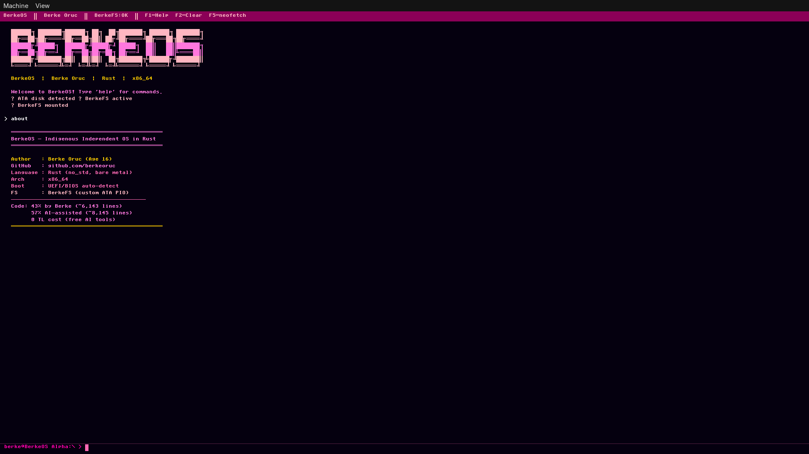

# BerkeOS

<div align="center">



**BerkeOS v0.6.3** — x86_64 İşletim Sistemi (Rust ile yazılmış)

[](https://www.rust-lang.org/)
[](#)
[](LICENSE)
[](#changelog)
[](#)

> 🇹🇷 Sıfırdan geliştirilen, Türk yapımı işletim sistemi

</div>

---

## 📋 İçindekiler

- [Hakkında](#-hakkında)
- [Özellikler](#-özellikler)
- [Modül Durumu](#-modül-durumu)
- [Hızlı Başlangıç](#-hızlı-başlangıç)
- [Mimari](#-mimari)
- [Shell Komutları](#-shell-komutları)
- [Sürüm Notları](#-sürüm-notları)
- [Katkıda Bulunma](#-katkıda-bulunma)

---

## 🎯 Hakkında

**BerkeOS**, Rust (`no_std`) ile sıfırdan geliştirilen, DOS ilhamlı, x86_64 monolitik çekirdekli bir işletim sistemidir.

### Temel Özellikler

| Özellik | Açıklama |
|:---|:---|
| 🦀 **Dil** | Rust (nightly, `no_std`) |
| 🖥️ **Mimari** | x86_64 Long Mode |
| 📁 **Dosya Sistemi** | BerkeFS (özel) + ATA PIO |
| 🐚 **Shell** | berkesh (30+ komut) |
| ✏️ **Editör** | Yerleşik `deno` editörü |
| 🎵 **Ses** | PC Speaker melodileri |
| ⏰ **RTC** | Gerçek zamanlı saat |
| 💰 **Maliyet** | 0 TL (tamamen ücretsiz AI araçları ile) |

### Proje İstatistikleri

| Metrik | Değer |
|:---|:---|
| Toplam Satır | ~14,288 |
| Geliştirici Yazdı | ~6,143 (%43) |
| AI Destekli | ~8,145 (%57) |
| Başlangıç | 2024 |
| Geliştirici | Berke Oruç (başlangıçta 14 yaşında) |

---

## 🛠️ Özellikler

### Çekirdek & Önyükleme
- UEFI/BIOS otomatik algılama
- 32-bit → 64-bit Long Mode geçişi
- 2 MiB huge page tabanlı bellek sayfalaması
- Heap allocator
- IDT + PIC 8259 + PIT 100Hz timer

### Dosya Sistemi & Depolama
- BerkeFS (12 sürücüye kadar destek)
- ATA PIO disk okuma/yazma
- Dizin ağacı, dosya işlemleri (oluştur, oku, yaz, sil)
- Sürücü bağlama/çıkarma/formatlama

### Shell & Kullanıcı Arayüzü
- `berkesh` — 30+ komutlu interaktif CLI
- VGA text modu (80×25 renkli)
- Framebuffer grafik modu
- `deno` — yerleşik metin editörü
- Hesap makinesi, neofetch, sistem bilgisi

### Aygıt Sürücüleri
- PS/2 klavye
- RTC (Gerçek Zamanlı Saat)
- PC Speaker (bip, melodiler)
- AHCI SATA (deneysel)
- USB OHCI + depolama (deneysel)
- RTL8139 ağ kartı (deneysel)

---

## ✅ Modül Durumu

| Modül | Dosya | Durum | Açıklama |
|:---|:---|:---:|:---|
| Önyükleme | `boot.asm`, `linker.ld` | ✅ | 32→64 bit Long Mode |
| VGA Text | `vga.rs` | ✅ | 80×25 renkli metin |
| Framebuffer | `framebuffer.rs`, `font.rs` | ✅ | Grafik modu, font |
| IDT + PIC + PIT | `idt.rs`, `pic.rs`, `pit.rs` | ✅ | Kesmeler, timer |
| PS/2 Klavye | `keyboard.rs` | ✅ | Tuş kodu çevirimi |
| Bellek Sayfalama | `paging.rs`, `allocator.rs` | ✅ | Heap allocator |
| ATA PIO Disk | `ata.rs` | ✅ | Sektör okuma/yazma |
| BerkeFS | `berkefs.rs` | ✅ | Özel dosya sistemi |
| Shell (berkesh) | `shell.rs` | ✅ | 30+ komut |
| Deno Editor | `deno.rs`, `editor.rs` | ✅ | Metin editörü |
| RTC Saat | `rtc.rs` | ✅ | Tarih/saat |
| PC Speaker | `pcspeaker.rs` | ✅ | Bip ve melodiler |
| Scheduler | `scheduler.rs` | ✅ | Process planlayıcı |
| Syscalls | `syscall.rs` | ✅ | Sistem çağrıları |
| AHCI/SATA | `ahci.rs` | 🧪 | Deneysel |
| USB Stack | `usb/` | 🧪 | Erken aşama |
| Network | `net/`, `rtl8139.rs` | 🧪 | Erken aşama |

**Not:** 🟢 Çalışıyor | 🟡 Deneysel | 🔴 Planlanan

---

## 🚀 Hızlı Başlangıç

### Gereksinimler

```bash
# Arch Linux
sudo pacman -S rust nasm grub xorriso qemu
rustup override set nightly
rustup component add rust-src llvm-tools-preview

# Ubuntu / Debian
sudo apt install build-essential rustc nasm grub-pc-bin xorriso qemu-system-x86
rustup override set nightly
rustup component add rust-src llvm-tools-preview
```

### Derleme & Çalıştırma

```bash
# 1. Repoyu klonla
git clone https://github.com/berkeoruc/berkeos.git
cd berkeos

# 2. Derle (ISO oluştur)
chmod +x build.sh
./build.sh

# 3. QEMU'da çalıştır
chmod +x run.sh
./run.sh

# UEFI modu için
./run.sh --uefi
```

### Test Komutları

```bash
# Headless mod (serial çıktı)
./run.sh --nographic 2>&1 | head -30

# Dosya sistemi testi
ls
touch test.txt
cat test.txt
fsck
ver
```

---

## 🏗️ Mimari

### Önyükleme Akışı

```
Power On → UEFI/BIOS → boot.asm (32-bit)
    ↓
Sayfa tabloları → Long Mode (64-bit)
    ↓
kernel_main() [Rust no_std]
    ↓
VGA/Framebuffer init → Klavye init → IDT/PIC/PIT
    ↓
Scheduler → ATA/AHCI algılama → BerkeFS mount
    ↓
berkesh Shell başlat
    ↓
Halt Loop
```

### Proje Yapısı

```
BerkeOS/
├── Cargo.toml              # Rust proje ayarları
├── linker.ld               # Linker script
├── build.sh                # Derleme betiği
├── run.sh                  # QEMU çalıştırma
│
├── assets/
│   ├── banner.png
│   └── screenshots/
│
└── src/
    ├── boot.asm            # NASM bootstrap
    ├── main.rs             # Cargo dummy entry
    ├── lib.rs              # kernel_main, global state
    │
    ├── idt.rs, pic.rs, pit.rs       # Kesme yönetimi
    ├── paging.rs, allocator.rs       # Bellek
    ├── scheduler.rs, process.rs      # Process yönetimi
    ├── syscall.rs                   # Sistem çağrıları
    │
    ├── vga.rs, framebuffer.rs, font.rs  # Grafik
    ├── keyboard.rs, ata.rs, rtc.rs       # Sürücüler
    ├── pcspeaker.rs, audio.rs            # Ses
    ├── ahci.rs, rtl8139.rs              # (deneysel)
    │
    ├── berkefs.rs             # Dosya sistemi
    ├── shell.rs               # Shell
    ├── deno.rs, editor.rs     # Editör
    │
    ├── usb/                  # USB stack (deneysel)
    └── net/                  # Ağ stack (deneysel)
```

---

## 💻 Shell Komutları

### Navigasyon
| Komut | Açıklama |
|:---|:---|
| `cd <dir>` | Dizin değiştir |
| `pwd` | Çalışma dizinini göster |
| `ls` / `dir` | Dizin içeriğini listele |
| `drives` | Sürücüleri listele |
| `df` | Disk kullanımı |

### Dosya İşlemleri
| Komut | Açıklama |
|:---|:---|
| `cat <file>` | Dosya içeriğini göster |
| `touch <file>` | Boş dosya oluştur |
| `mkdir <dir>` | Dizin oluştur |
| `rm <path>` | Dosya/dizin sil |
| `cp <src> <dst>` | Dosya kopyala |
| `mv <src> <dst>` | Dosya taşı/yeniden adlandır |
| `find <name>` | Dosya ara |
| `stat <path>` | Dosya bilgisi |

### Sistem
| Komut | Açıklama |
|:---|:---|
| `help` | Komutları listele |
| `ver` | Sürüm bilgisi |
| `date` | Tarih/saat |
| `mem` | Bellek kullanımı |
| `sysinfo` | Sistem bilgisi |
| `neofetch` | Sistem özeti |
| `uptime` | Çalışma süresi |

### Araçlar & Yönetim
| Komut | Açıklama |
|:---|:---|
| `calc <expr>` | Hesap makinesi |
| `beep` | Bip sesi |
| `play <melody>` | Melodi çal |
| `deno <file>` | Editör aç |
| `format <drv>` | Sürücüyü formatla |
| `fsck` | Dosya sistemi kontrolü |
| `reboot` | Yeniden başlat |
| `halt` | Kapat |

---

## 🗺️ Yol Haritası

| Sürüm | Hedefler |
|:---|:---|
| **v0.7** | Stabilite & İyileştirme |
| **v0.8** | BerkeFS v2, Shell UX, Drive Registry |
| **v0.9** | TCP/IP, Ses Kartı, USB Stabilizasyonu |
| **v1.0** | SMP, GUI Desktop, Package Manager |

---

## 📜 Sürüm Notları

### v0.6.3 — Stabilizasyon
> **Tarih: Mart 2026**

| Değişiklik | Açıklama |
|:---|:---|
| 🔌 **Serial Port** | COM1 driver (115200 8N1) eklendi |
| 📝 **Log Macros** | kinfo!, kwarn!, kerr!, kdebug! |
| 🚨 **Panic Handler** | Serial output + stack dump |
| 🗂️ **DriveRegistry** | FS0..FS11 → tek struct |
| ✅ **fsck** | BerkeFS doğrulama aracı |
| 🤖 **CI/CD** | GitHub Actions pipeline |
| 📦 **Test Harness** | Otomatik test betiği |

### v0.6.2 — UI/UX & Kod Kalitesi
> **Tarih: Mart 2026**

- ASCII logo eklendi
- Tüm Unicode kutular Türkçeden İngilizceye çevrildi
- Sessiz önyükleme (GRUB timeout = 0)
- Global state refactor (static mut → spin::Mutex)

### v0.6.1 — Stabilite
> Hata düzeltmeleri

### v0.6.0 — İlk Sürüm
> Temel işlevsellik

---

## 🤝 Katkıda Bulunma

Katkılar memnuniyetle karşılanır! Hata düzeltmeleri, yeni sürücüler, dokümantasyon iyileştirmeleri — her türlü yardap değerlidir.

```bash
# 1. Fork yap
# 2. Feature branch oluştur
git checkout -b feature/yeni-ozellik

# 3. Değişiklikleri yap ve commit
git commit -m "feat: yeni özellik eklendi"

# 4. Fork'a push et
git push origin feature/yeni-ozellik

# 5. Pull Request aç
```

### Başlangıç Noktaları
- 📝 Inline dokümantasyonu iyileştir
- 🧪 Modülleri QEMU'da test et
- 📸 Ekran görüntüleri ekle
- 🌍 Farklı klavye düzenleri ekle

---

## 📄 Lisans

Apache License 2.0 — Copyright 2024-2026 Berke Oruç

---

## 🙏 Teşekkürler

- **Rust Topluluğu** — `no_std` ekosistem
- **OSDev Wiki** — Çekirdek geliştirme kaynakları
- **Ücretsiz AI Araçları** — Projeyi mümkün kılan
- **Açık Kaynak** — Paylaşım ve işbirliği ruhu
